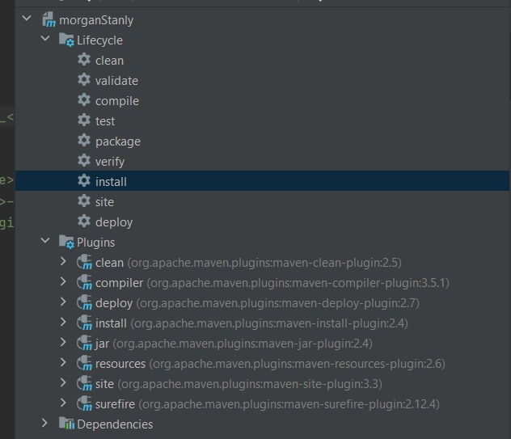

This programme validates the file name only. 
Runs on jdk15.
Enter input file name in valid format[case Sensitive] with _ as separator, Test_<portfoliocode>_<ddmmyyyy>_<2digit-sequencenumber> where portfoliocode is A or B or C
   
You can have an actual file on a path on your machine or just the name of the file has to be supplied on the commandline as;

jar file has been committed you can use that directly or can compile in your local using build deploy image shown below

===============================================================================================

C:\Users\anigh\.m2\repository\com\au\morganStanly\1.0-SNAPSHOT>java -jar morganStanly-1.0-SNAPSHOT.jar
Sep 23, 2022 1:15:33 PM com.au.ms.delegate.Main main
INFO: Enter input file name in valid format[case Sensitive] with _ as separator and 4 parts, Test_<portfoliocode>_<ddmmyyyy>_<2digit-sequencenumber> where portfoliocode is A or B or C
Test_C_22032084_46
Sep 23, 2022 1:15:36 PM com.au.ms.delegate.Main main
INFO: the input File path Test_C_22032084_46 . And file name Test_C_22032084_46 to Validate
Sep 23, 2022 1:15:36 PM com.au.ms.delegate.Main main
INFO:

the  file name Test_C_22032084_46 is valid    (NB sometimes users enter file names without extensions so allow them)

===============================================================================================

C:\Users\anigh\.m2\repository\com\au\morganStanly\1.0-SNAPSHOT>java -jar morganStanly-1.0-SNAPSHOT.jar
Sep 23, 2022 1:15:52 PM com.au.ms.delegate.Main main
INFO: Enter input file name in valid format[case Sensitive] with _ as separator and 4 parts, Test_<portfoliocode>_<ddmmyyyy>_<2digit-sequencenumber> where portfoliocode is A or B or C
Test_C_22032084_46.abcd
Sep 23, 2022 1:15:57 PM com.au.ms.delegate.Main main
INFO: the input File path Test_C_22032084_46.abcd . And file name Test_C_22032084_46.abcd to Validate
Sep 23, 2022 1:15:57 PM com.au.ms.delegate.Main main
INFO:

the  file name Test_C_22032084_46.abcd is valid

===============================================================================================
C:\Users\anigh\.m2\repository\com\au\morganStanly\1.0-SNAPSHOT>java -jar morganStanly-1.0-SNAPSHOT.jar
Sep 23, 2022 1:16:11 PM com.au.ms.delegate.Main main
INFO: Enter input file name in valid format[case Sensitive] with _ as separator and 4 parts, Test_<portfoliocode>_<ddmmyyyy>_<2digit-sequencenumber> where portfoliocode is A or B or C
Test_C_2203992084_35
Sep 23, 2022 1:16:35 PM com.au.ms.delegate.Main main
INFO: the input File path Test_C_2203992084_35 . And file name Test_C_2203992084_35 to Validate
Sep 23, 2022 1:16:35 PM com.au.ms.delegate.Main main
SEVERE:

File Name is not in valid format
com.au.ms.delegate.FileNameNotValidException: invalid date format  2203992084, has to be <ddmmyyyy>û date format dd e.g 07, mm e.g 12, yyyy e.g 1987.
at com.au.ms.delegate.FileNameValidator.validateDateFormat(FileNameValidator.java:49)
at com.au.ms.delegate.FileNameValidator.validateFileName(FileNameValidator.java:17)
at com.au.ms.delegate.Main.main(Main.java:35)

===============================================================================================

run build install using maven

